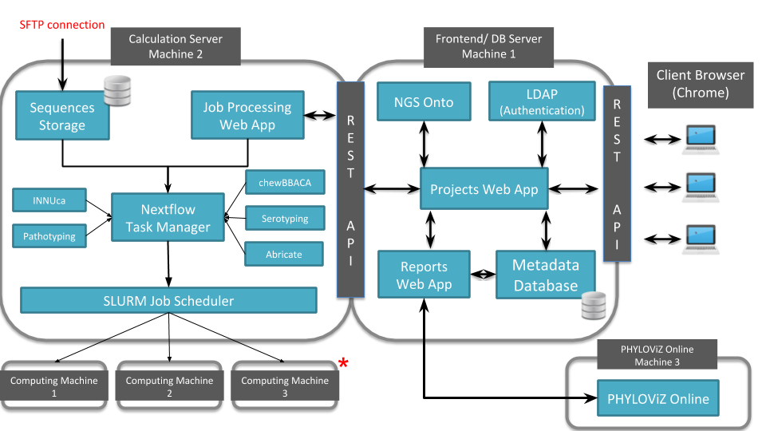

INNUENDO Platform
=================

**A novel cross-sectorial platform for the integration of genomics in
surveillance of foodborne pathogens**

Multinational outbreaks of foodborne pathogens cause considerable threats to
European public health. Implementing whole genome sequencing (WGS) in routine
surveillance and outbreak investigations is becoming a strategic goal for many
public health authorities all over the world. With this in mind we developed
the initiative INNUENDO, which aims to deliver a cross-sectorial framework for
the integration of bacterial WGS in routine surveillance and epidemiologic
investigations.

**INNUENDO platform** is divided into two distinct applications that communicate
between each other. The first one, the **INNUENDO frontend server**,
comprises the user web interface and mechanisms to allow secure user
authentication with LDAP and data storage into a dedicated database. It also
communicates with the **INNUENDO process controller**, which was developed with
the aim of working as a bridge to allow running analytical procedures on a
laptop or in a High Performance Computer (HPC), with the help of SLURM
process manager and Nextflow.

There is also a **docker-compose** version of the platform that can be easily
installed with a few commands.

Contents
========

The documentation of the **INNUENDO Platform** follows the below structure:

* :ref:`dependencies`

* :ref:`installation`

* :ref:`docker-compose`

* :ref:`usage`

* :ref:`troubleshooting`

.. _dependencies:

.. toctree::
   :maxdepth: 1
   :caption: Dependencies

   dependencies/dependencies-list

.. _installation:

.. toctree::
   :maxdepth: 1
   :caption: Installation

   installation/nginx
   installation/allegrograph
   installation/postgres
   installation/ldap
   installation/slurm
   installation/frontend
   installation/controller
   installation/nextflow
   installation/flowcraft

.. _docker-compose:

.. toctree::
   :maxdepth: 1
   :caption: Docker-Compose

   docker-compose/docker-compose

.. _usage:

.. toctree::
   :maxdepth: 1
   :caption: Usage

   usage/set-species
   usage/set-protocols
   usage/set-workflows

.. _troubleshooting:

.. toctree::
   :maxdepth: 1
   :caption: Admins: Troubleshooting and Backup

   troubleshooting/backups
   troubleshooting/inspecting_logs
   troubleshooting/troubleshooting

.. _api:

.. toctree::
   :maxdepth: 1
   :caption: REST API

   api/rest
