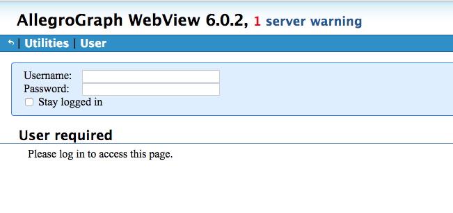
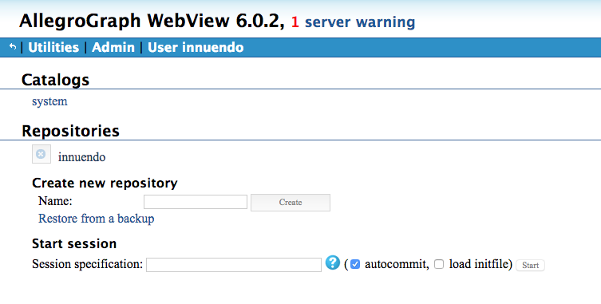
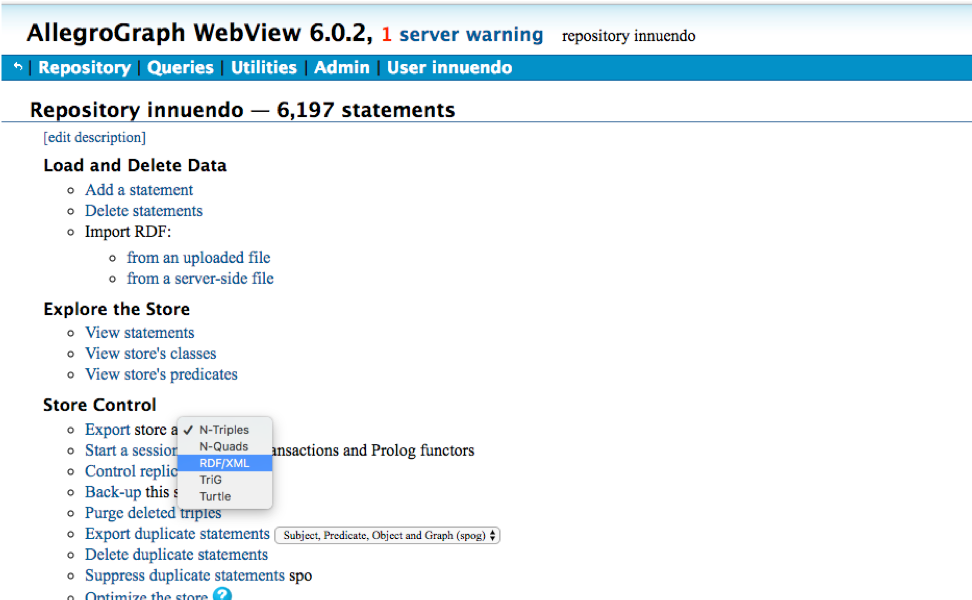
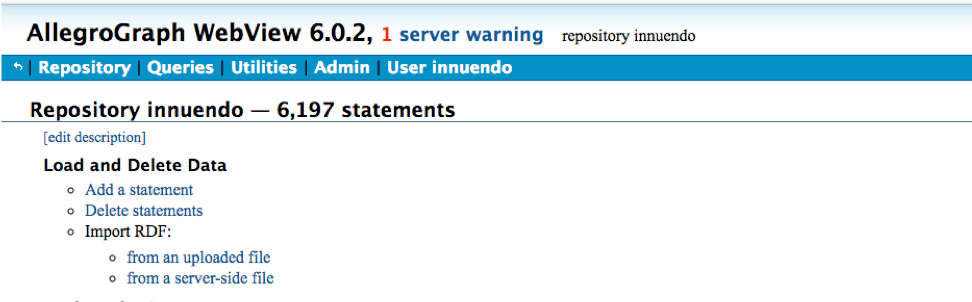

Backing up Data
===============

Backing up data is an essential feature on every system and in the INNUENDO
Platform that is no exception. As so, bellow we provide the required commands
to backup all data on the system.

The INNUENDO Platform is composed of 3 databases: The **frontend database**,
the **wgMLST database** and the **allegrograph database**. The first two are
postgreSQL relational databases and the third a triplestore (graph based
database).

Backing up postgreSQL databases
^^^^^^^^^^^^^^^^^^^^^^^^^^^^^^^

postgreSQL provides a built in tool for backing up its databases. It builds a
file with all the instructions required to rebuild the database in other
instance if required.

To backup the frontend database, run the following command on the machine
running the service:

::

    # This command will produce a new file called output_file.db that will
    # have all the instructions to build the database. Replace
    # <database_user> and <database_name> by the database owner and the wgMLST
    # database name.
    pg_dump -U <database_user> <database_name> > output_file_frontend.db

To backup the wgMLST database, run the following command on the machine
running the service:

::

    # This command will produce a new file called output_file.db that will
    # have all the instructions to build the database. Replace
    # <database_user> and <database_name> by the database owner and the wgMLST
    # database name.
    pg_dump -U <database_user> <database_name> > output_file_wgmlst.db

To restore the database, run the following command on the machine running the
postgreSQL service.

::

    # The text files created by pg_dump are intended to be read in by the psql program.
    # Replace <database_user> and <database_name> by the database owner and database name.
    psql -U <database_user> <database_name> < output_file.db

The INNUENDO Platform also provides a script for automatic backup of
postgreSQL databases located inside the **build_files** directory inside
**INNUENDO_REST_API**.

::

    # Parameters
    # mode: [backup, build]
    # database: database_name
    # postgresUser: Postgres username and owner of database
    # postgresPass: Postgres password
    # fileLocation: Location of output or input file (depening on the mode
    backup_dbs.sh <mode> <database> <postgresUser> <postgresPass> <fileLocation>

Backing up AllegroGraph database
^^^^^^^^^^^^^^^^^^^^^^^^^^^^^^^^

The AllegroGraph database is a different type of database. Is not a
relational database. Instead, it stores relationships between objects in the
form of a graph. It is used on the INNUENDO Platform as the backbone to get
track of relationships between, projects, strains, workflows, processes and
their outputs.

To backup the AllegroGraph database, we can use their web application. To do
that, go to the defined configuration url for the AllegroGraph web
application. There you will need to login as seen bellow with your
AllegroGraph username and password.

After logging in, you will enter in a new page with information regarding the
available repositories. You should see the already created repository for
the INNUENDO Platform. In this case, it has the name *innuendo*.

After clicking on the desired repository, you can export the database by
going to **Export store as** and select **RDF/XML**. This will create a file
with the structure of the database that you can then load into AllegroGraph
also using the web application.

To do that, on the same page as the Export, there is an option to **Import
RDF**. Choose the option **from an uploaded file** and add one file obtained
from the Export option. At the end you should get the repository restored.

In addition to the previous steps, the INNUENDO Platform provides a
programmatic way to backup and restore the AllegroGraph database using the
script **build_allegro.py** located at the **build_files** directory inside
**INNUENDO_REST_API**.

::

    # Parameters
    # mode: [backup, build]
    # fileLocation: Location of the output or input file
    #
    # Steps
    # Copy build_allegro.py to INNUENDO_REST_API since it requires to be run
    on that location.
    cp <INNUENDO_REST_API_location>/build_files/build_allegro.py <INNUENDO_REST_API_location>/
    # Add AllegroGraph client to the PYTHONPATH
    export PYTHONPATH="<INNUENDO_REST_API_LOCATION>/agraph-6.2.1-client-python/src"
    # Run the script
    flask/bin/python build_allegro.py <mode> <fileLocation>

Backing up Nextflow runs Data
^^^^^^^^^^^^^^^^^^^^^^^^^^^^^

All processes submitted to the INNUENDO Platform are managed by Nextflow and
SLURM managers. Software runs that they manage are stored in the file system
in directories structures and not in databases. As so, results derived
directly from the software being run stay in those directory structures eg,
raw reads, fasta files and other software outputs. Only post-processed
selected data is sent to the INNUENDO Reports to be visualized.

Data from runs is stored by default in the `/<usersStorage>/<user>/<jobs>`.

Inside each job folder you will have results and recipes to run the processes
for each strain. Since each pipeline is associated with a strain in a given
project, inside the `jobs` directory you will find folders with the structure
`<project_id>-<pipeline_id>`. Inside those folder you can find other folder
called `results` where all the relevant information regarding that pipeline
is stored.

::

    # Runs directory structure

    - <usersStorage>
        - <user>
            - <jobs>
                - <project_id>-<pipeline_id>
                    - <results>
                    - <work>
                        - processes generated files
                    - executor_command.sh -> To rerun pipeline

